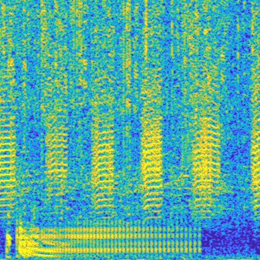
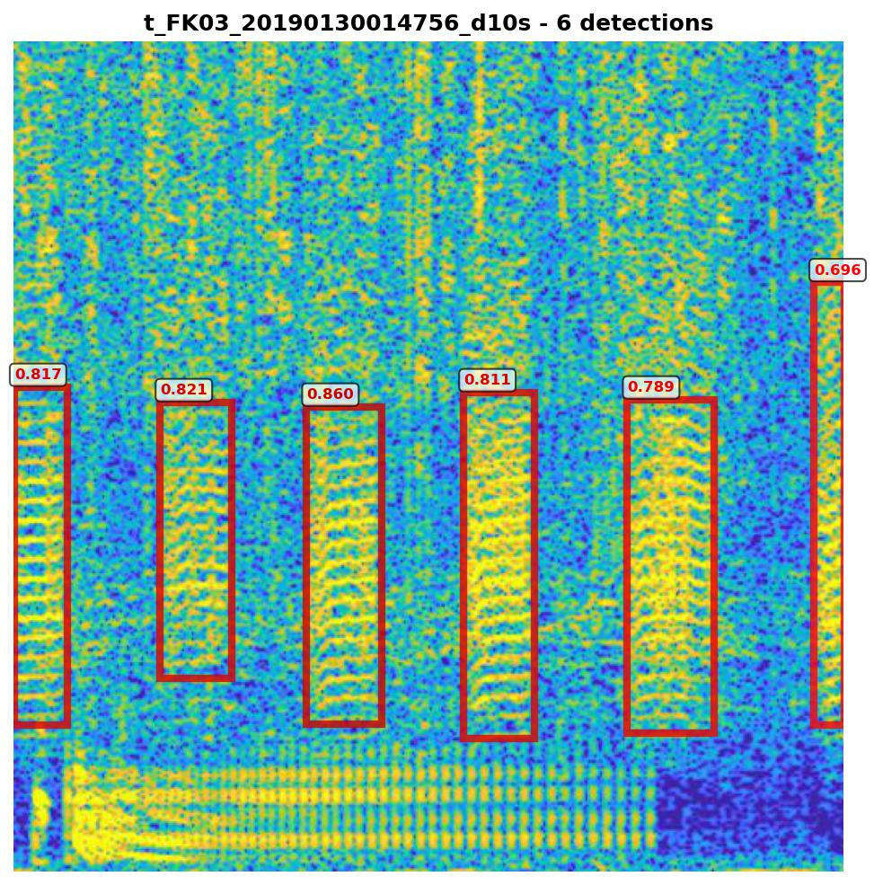

# Toadfish Art — Underwater Spectrogram

Interactive spectrogram visualization of underwater sound from the Florida Keys National Marine Sanctuary, created for the **2026 Libraries Art Show**.

**Live site:** [alptezbasaran.github.io/toadfish-art](https://alptezbasaran.github.io/toadfish-art/)

## What am I looking at?

This is a spectrogram of underwater sound recorded at a site within the Florida Keys National Marine Sanctuary. This is a ten second recording, with the colors showing how loud the sound is, with brighter yellow colors being louder sounds, and cooler blue colors being quieter sounds. Sounds in the upper part of the image are higher frequency (higher pitch) sounds, and lower in the image are lower frequency (pitch) sounds.


*Spectrogram of the 10-second underwater recording*

Part of my research is to identify the different fish calls in these sound recordings. Here, the focus is on the call of the leopard toadfish, *Opsanus pardus*, a bottom-dwelling fish that lives in the crevices of the reef structure and produces a "boatwhistle" call to attract mates. In this image, we also see the call of another fish, the red hind, *Epinephelus guttatus*, another reef-dwelling fish in the grouper family. While not the target of my research, it shows the diversity of biological sounds that we can observe in a short sound clip.


*Detected fish calls with confidence scores — toadfish boatwhistles and red hind calls*

For more information on the SanctSound project, visit [sanctsound.ioos.us](https://sanctsound.ioos.us/s_fknms.html). For more information on fish call detection, see [doi.org/10.1371/journal.pone.0182757](https://doi.org/10.1371/journal.pone.0182757).

## Features

- Full-screen artistic spectrogram (14,400 x 7,200 px, 0–1,750 Hz)
- 16 colormap options with live switching (Inferno, Magma, Plasma, Viridis, Turbo, and more)
- Play/pause button for the filtered underwater audio (0–1,750 Hz band)
- Loop toggle for continuous playback
- "What am I looking at?" info panel with research images and description
- QR code overlay linking to the live page

## Run locally with Docker

```bash
docker build -f Dockerfile.web -t toadfish-art .
docker run --rm -p 8080:80 toadfish-art
```

Then open [http://localhost:8080](http://localhost:8080).

## Author

**Shannon Ricci**
